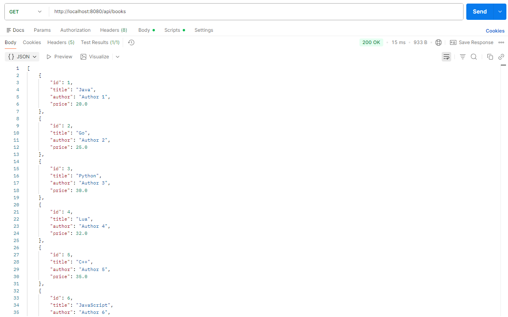
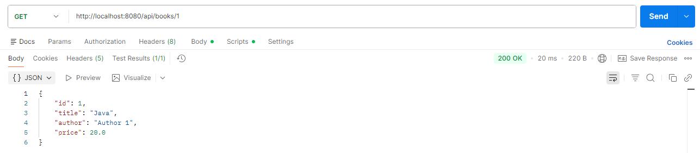
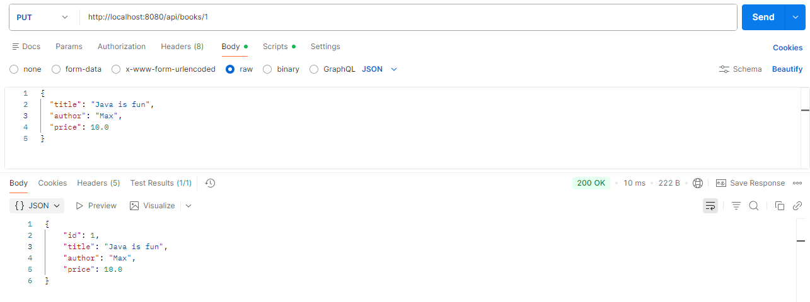
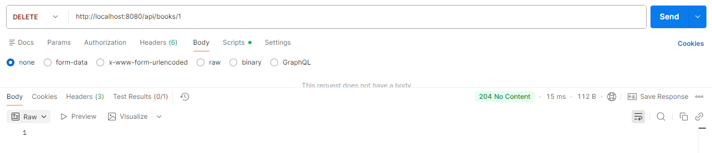
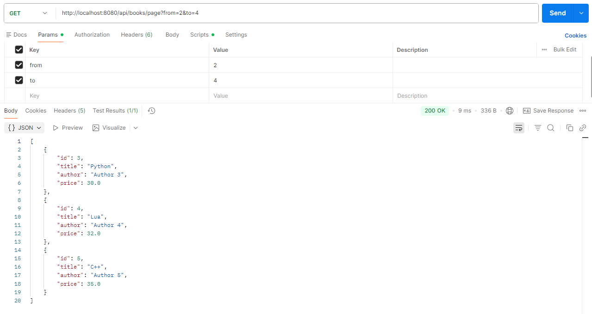
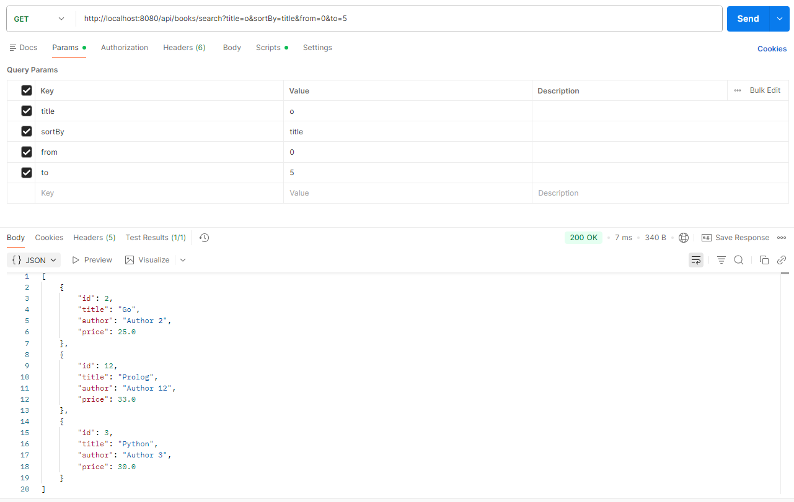

# Homework 1

## Endpoints

Get all books
```
GET /api/books
```
Example:


Get book by id
```
GET /api/books/{id}
```
Example:


Create book
```
POST /api/books
```
Request body
```json
{
  "id": "100",
  "title": "Learn GO",
  "author": "Max",
  "price": 30.0
}
```
Example:


Update entire book
```
PUT /api/books/{id}
```
Request body
```json
{
  "title": "Java is fun",
  "author": "Max",
  "price": 10.0
}
```
Example:


Update part of a book
```
PATCH /api/books/{id}
```
Request body
```json
{
  "title": "C++ for beginners"
}
```
Example:


Delete book
```
DELETE /api/books/{id}
```
Example:



GET books with pagination
```
GET /api/books/page
```
Request params
```
from:   2
to:     4
```
Example:

Advanced GET endpoint with filtering, sorting, and pagination combined in the valid order

Search by title
```
GET /api/books/search
```

Request params
```
title:  o 
from:   0
to:     5
sortBy: title
```
Example:

